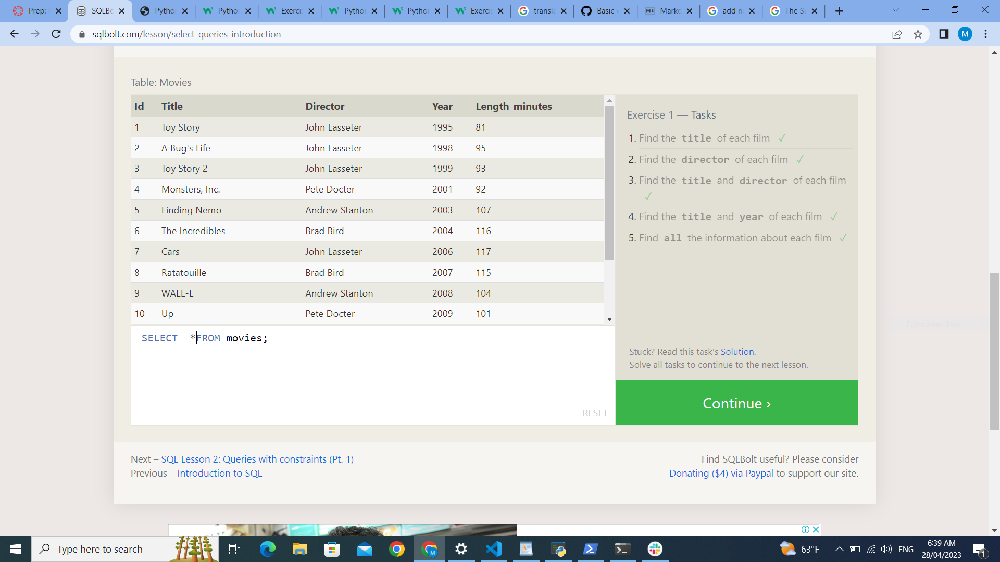
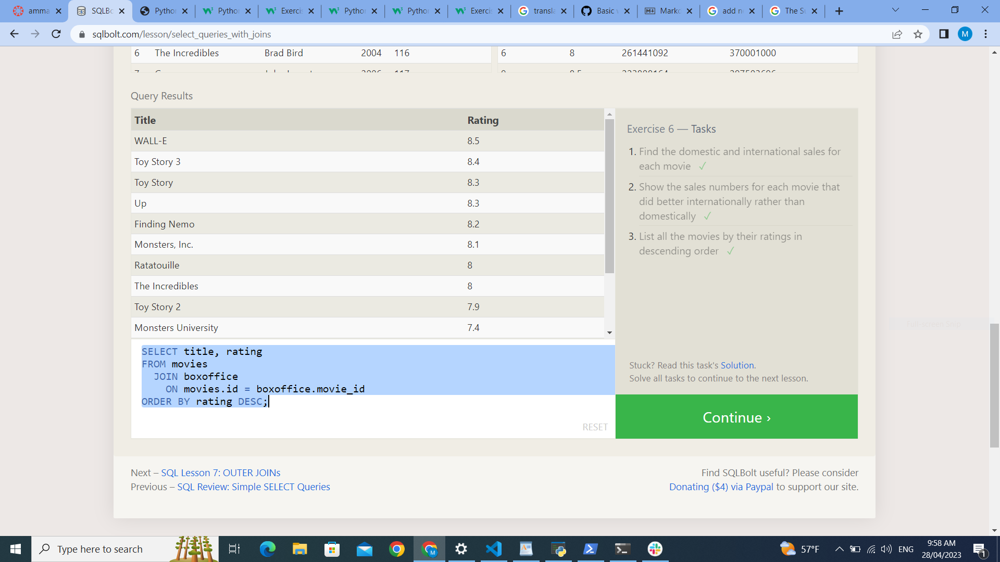

## Database & SQL
Relational databases store data in tables. Tables can grow large and have a multitude of columns and records. Relational database management systems (RDBMSs) use SQL (and variants of SQL) to manage the data in these large tables.
## SQL
(Structured Query Language) is a programming language used to communicate with data stored in a relational database management system. SQL syntax is similar to the English language, which makes it relatively easy to write, read, and interpret.
using the SQL can be delete and update the rows in the table and can be joun the table between them by using the INNER ,lEFT, RIGHT,FULL JOUN  and multible action on the table 

 ## JOIN 
 clause is used to combine rows from two or more tables, based on a related column between them.
 +  (INNER) JOIN: Returns records that have matching values in both tables
+ LEFT (OUTER) JOIN: Returns all records from the left table, and the matched records from the right table
+ RIGHT (OUTER) JOIN: Returns all records from the right table, and the matched records from the left table
+ FULL (OUTER) JOIN: Returns all records when there is a match in either left or right table

 
 
 
 
 

 
 
 
 
 
 
 
 
 
